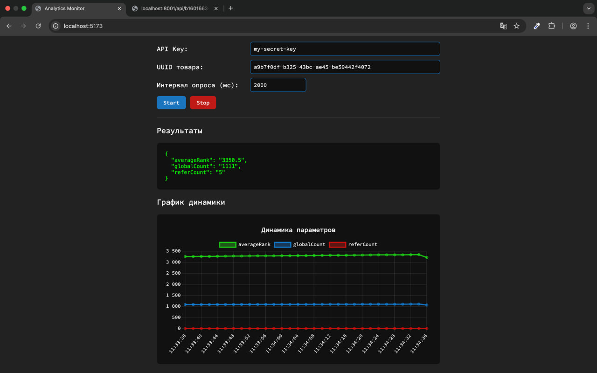

## MVP аналитического модуля маркетплейса

MVP предназначен для демонстрации потоковой аналитики пользовательских событий с расчетом ключевых метрик эффективности товаров и визуализацией динамики в реальном времени. Модуль реализует полный конвейер: события → поток → агрегированная аналитика → REST API → веб-интерфейс.

События пользователей поступают через Kafka, сохраняются в ClickHouse и агрегируются по ключевым метрикам: globalCount — количество показов, referCount — количество переходов, averageRank — средняя позиция товара. Метрики доступны через REST API с проверкой API-ключа (X-API-KEY). Веб-интерфейс отображает текущие значения и график динамики за последние N измерений, ошибки сервера и доступа визуально выделяются.

Панель управления содержит выровненные поля ввода и кнопки Start/Stop. MVP позволяет проверить работу конвейера событий, визуально оценить динамику метрик, протестировать REST API и служит базой для расширения аналитики.

#### Технологии

- Java Spring Boot, Hexagonal Architecture
- Kafka, ClickHouse
- Docker, Testcontainers
- React, Chart.js
- Swagger/OpenAPI