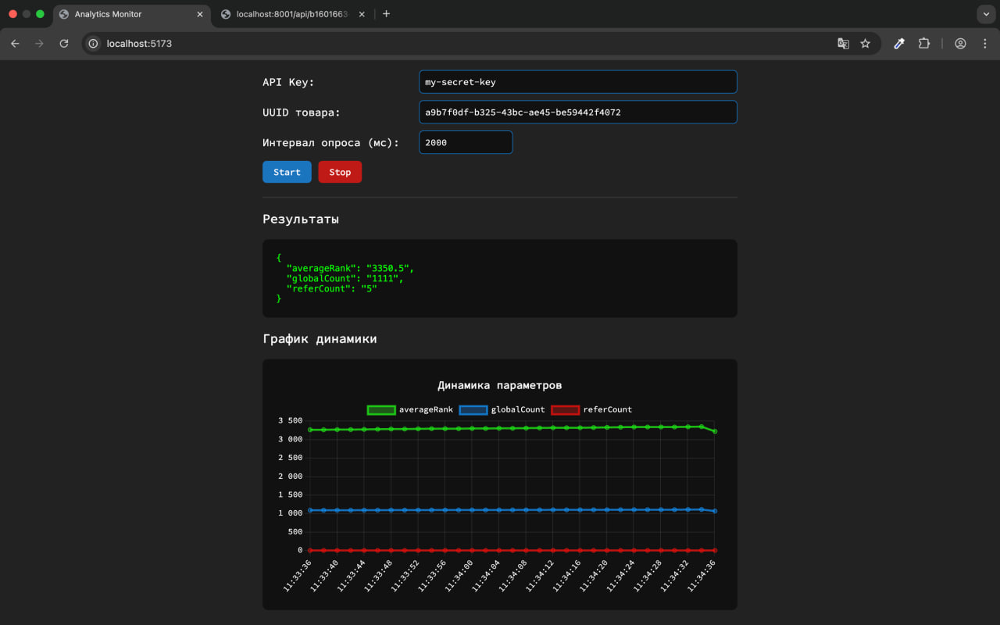

# Analytic Module

MVP аналитического модуля для marketplace-сценария: синтетические пользовательские события проходят через Kafka, сохраняются в ClickHouse, агрегируются в backend-сервисе на Spring Boot и отображаются в React dashboard через REST или WebSocket.

Проект показывает мои сильные стороны как backend/data engineer: проектирование event-driven pipeline, интеграцию Kafka и ClickHouse, сборку многомодульного сервиса, real-time delivery данных в UI и воспроизводимую локальную среду через Docker Compose.



## Что делает проект

- генерирует события просмотров и переходов встроенным `simulator`
- передает события через Kafka-топики `market-requested` и `market-referred`
- сохраняет сырые данные в ClickHouse
- считает метрики `globalCount`, `referCount`, `averageRank`
- отдает аналитику через REST API и WebSocket
- визуализирует метрики в dashboard с `REST polling` и `WebSocket` режимами

## Архитектура

```text
simulator -> Kafka -> analytic -> ClickHouse -> REST / WebSocket -> analytic-monitor
```

### Компоненты

- `modules/analytic`  
  Spring Boot backend: Kafka consumers, ClickHouse access, REST API, WebSocket updates.
- `modules/simulator`  
  Генератор синтетических событий по расписанию.
- `modules/libs-analytic`  
  Общие event-модели для backend и simulator.
- `modules/analytic-monitor`  
  React/Vite dashboard для просмотра метрик в реальном времени.
- `docker-compose.yml`  
  Поднимает полный локальный контур: `analytic`, `simulator`, `frontend`, `kafka`, `zookeeper`, `kafka-ui`, `clickhouse`, `ch-ui`.

## Технический стек

- Backend: `Java 17`, `Spring Boot`, `Spring Kafka`, `Spring WebSocket`, `Spring JDBC`
- Data: `Kafka`, `ClickHouse`
- Frontend: `React`, `Vite`, `Chart.js`
- Infra: `Docker Compose`, `Nginx`
- API: `REST`, `WebSocket`, `OpenAPI annotations`, `X-API-KEY`

## Ключевой функционал

- потоковая доставка событий из `simulator` в `analytic` через Kafka
- автосоздание ClickHouse schema и таблиц на старте backend-сервиса
- on-demand агрегация метрик SQL-запросами
- REST endpoints:
  - `GET /api/{manufactureId}/show`
  - `GET /api/{manufactureId}/avg`
  - `GET /api/{manufactureId}/refer`
  - `GET /api/{manufactureId}/count`
- WebSocket endpoint:
  - `/ws/analytics?manufactureId=...&apiKey=...`
- dashboard с историей значений и переключением между `REST polling` и `WebSocket`

## Структура репозитория

```text
modules/
  analytic/           backend analytics service
  simulator/          synthetic event generator
  libs-analytic/      shared event contracts
  analytic-monitor/   React dashboard
docker-compose.yml
docs/current-project-summary.md
```

## Запуск

```bash
docker compose up --build
```

### Локальные URL

- Frontend: `http://localhost:5173`
- Analytic API: `http://localhost:8001`
- Simulator API: `http://localhost:8002/simulator/config`
- Kafka UI: `http://localhost:8080`
- ClickHouse UI: `http://localhost:5521`

API key на уровне приложения задается через `API_KEY`; если переменная не передана, backend использует значение по умолчанию `secret`.

## Что важно понимать

- это MVP с синтетическим источником данных, а не интеграция с production marketplace
- в текущем проекте нет PostgreSQL, ETL из внешней БД и сложного security-layer
- основной акцент сделан на streaming pipeline, аналитическом хранилище и real-time визуализации
